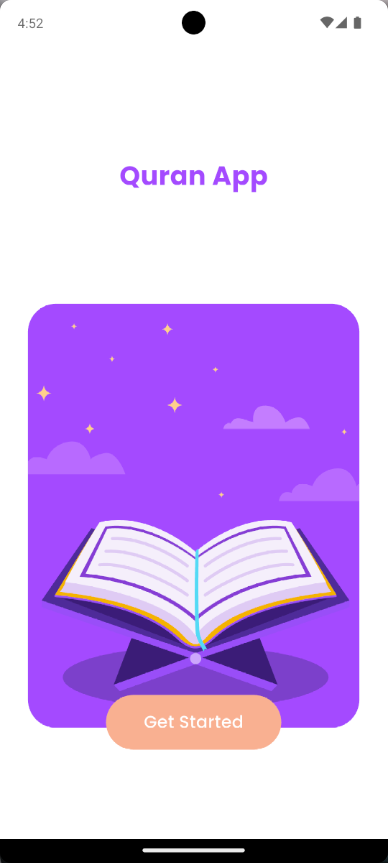
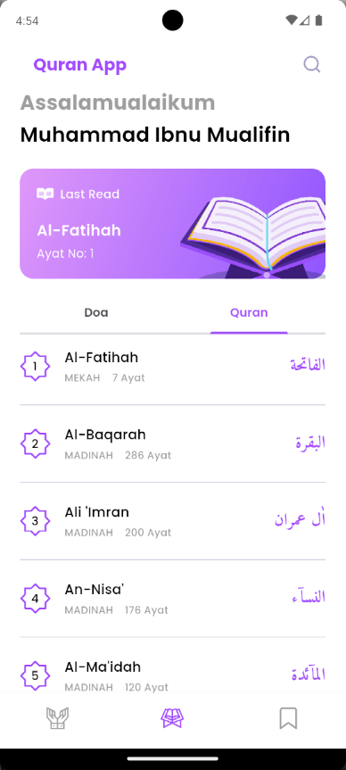
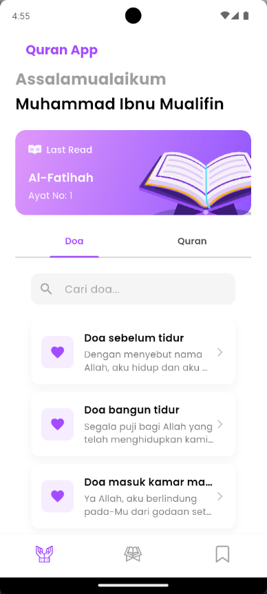
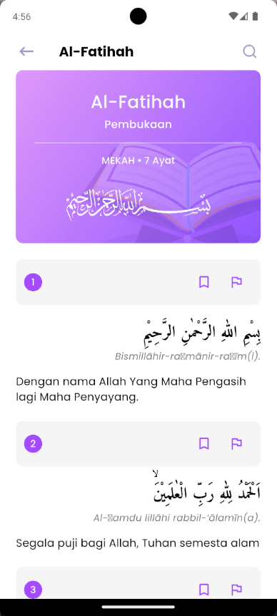
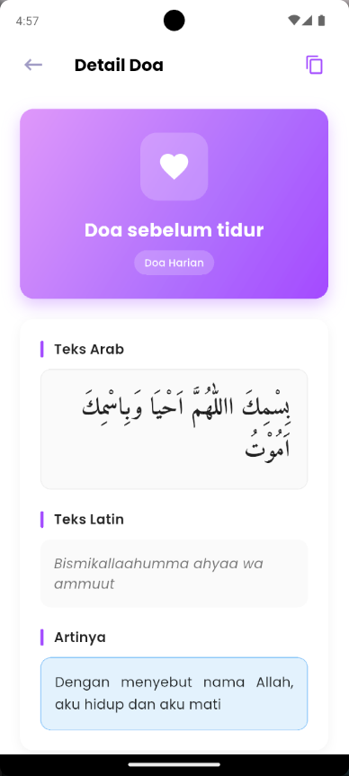
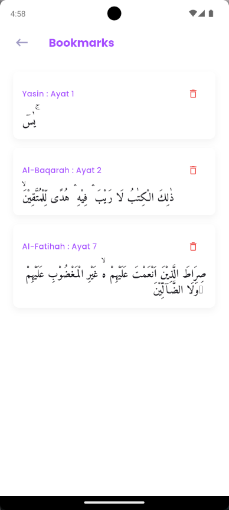

# 📖 Quran App

Aplikasi Quran mobile yang dibuat dengan Flutter untuk memudahkan pengguna dalam membaca dan mempelajari Al-Qur'an. Aplikasi ini dilengkapi dengan fitur bookmark untuk menyimpan ayat-ayat favorit dan antarmuka yang user-friendly.

## 📱 Tentang Aplikasi

Aplikasi Quran adalah aplikasi mobile lintas platform yang menampilkan:

- Daftar lengkap 114 surah Al-Qur'an
- Detail surah dengan terjemahan bahasa Indonesia
- Fitur bookmark untuk menyimpan ayat favorit
- Interface yang bersih dan mudah digunakan
- Navigasi yang intuitif antar surah

### 🎯 Fitur Utama

- **📚 Daftar Surah**: Menampilkan semua surah Al-Qur'an dengan informasi lengkap
- **🔍 Pencarian**: Fitur pencarian Surah dan Ayat yang akurat
- **🤲 Doa Harian**: Kumpulan doa-doa harian dengan terjemahan
- **📖 Detail Surah**: Menampilkan ayat per ayat dengan teks Arab, terjemahan, dan transliterasi
- **🔖 Bookmark**: Menyimpan ayat favorit untuk dibaca kembali
- **📑 Last Read**: Menyimpan jejak terakhir dibaca secara otomatis maupun manual per ayat
- **⚡ Fast Loading**: Optimasi performa untuk pengalaman membaca yang nyaman
- **🎨 Beautiful UI**: Desain modern dengan warna yang nyaman untuk mata
- **⚡ Offline Support**: Data lokal tersedia untuk akses tanpa internet

## 🛠️ Teknologi yang Digunakan

### Frontend

- **Flutter** (v3.9.2+): Framework untuk membangun aplikasi mobile
- **Dart**: Bahasa pemrograman utama
- **Google Fonts**: Typography yang menarik (Poppins & Amiri)
- **SVG Assets**: Ikon dan grafis yang scalable

### Backend & API

- **EQuran API**: Sumber data Al-Qur'an digital Indonesia
- **HTTP Requests**: Menggunakan package Dio untuk networking

### Storage

- **SharedPreferences**: Penyimpanan data lokal untuk bookmark
- **Memory Cache**: Fallback storage untuk reliability
- **Local JSON**: Data offline untuk akses tanpa internet

### Dev Tools

- **Flutter Lints**: Code quality dan best practices
- **Build Runner**: Code generation

## 📡 API Endpoint

Aplikasi menggunakan **EQuran API v2** yang disediakan oleh https://equran.id

### Endpoint yang Digunakan:

#### 1. Get All Surah (Daftar Surah)

```
GET https://equran.id/api/v2/surat
```

**Response:**

- Daftar lengkap 114 surah
- Informasi nomor surah, nama Arab, nama Latin, arti, jumlah ayat, tempat turun
- Audio full surah

#### 2. Get Surah Detail (Detail Surah)

```
GET https://equran.id/api/v2/surat/{noSurat}
```

**Parameter:**

- `noSurat` (int): Nomor surah (1-114)

**Response:**

- Detail lengkap surah
- Semua ayat dengan:
  - Teks Arab
  - Teks Latin (transliterasi)
  - Terjemahan Bahasa Indonesia
  - Audio per ayat
- Metadata surah (nama, arti, tempat turun, dll)

### Contoh Usage:

```dart
// Get all surah
final response = await Dio().get('https://equran.id/api/v2/surat');
List<Surah> surahs = surahFromJson(response.toString());

// Get surah detail
final response = await Dio().get('https://equran.id/api/v2/surat/1');
Surah alFatihah = surahDetailFromJson(response.toString());
```

### API Rate Limiting

- Tidak ada dokumentasi resmi tentang rate limiting
- Disarankan untuk tidak melakukan request berlebihan
- Implementasi caching di client untuk optimasi

## 🚀 Cara Instalasi

### Prerequisites

Sebelum menginstal aplikasi, pastikan Anda sudah memiliki:

1. **Flutter SDK** (v3.9.2 atau lebih tinggi)

   ```bash
   # Install Flutter
   # Download dari https://flutter.dev/docs/get-started/install

   # Verifikasi instalasi
   flutter doctor
   ```

2. **Android Studio** atau **VS Code** dengan Flutter extension
3. **Android SDK** (untuk development Android)
4. **Xcode** (untuk development iOS, hanya macOS)

### Step 1: Clone Repository

```bash
# Clone repository
git clone <repository-url>

# Masuk ke direktori project
cd quran_app
```

### Step 2: Install Dependencies

```bash
# Install semua dependencies
flutter pub get

# Atau menggunakan pub
dart pub get
```

### Step 3: Konfigurasi Environment

Tidak ada konfigurasi environment khusus yang diperlukan karena aplikasi menggunakan API publik.

### Step 4: Run Application

#### Development Mode:

```bash
# Run di connected device/emulator
flutter run

# Run di specific device
flutter run -d <device-id>

# Hot restart (r) dan hot reload (R) saat aplikasi berjalan
```

#### Build untuk Production:

```bash
# Build APK untuk Android
flutter build apk --release

# Build App Bundle untuk Google Play
flutter build appbundle --release

# Build untuk iOS
flutter build ios --release
```

## 📁 Struktur Project

```
quran_app/
├── lib/
│   ├── models/                 # Data models
│   │   ├── surah.dart         # Model untuk data surah
│   │   └── ayat.dart          # Model untuk data ayat
│   ├── screens/               # UI Screens
│   │   ├── bookmark_screen.dart    # Screen untuk daftar bookmark
│   │   ├── surah_detail_screen.dart # Screen untuk detail surah
│   │   └── ...                 # Screen lainnya
│   ├── services/              # Business logic & services
│   │   └── bookmark_storage.dart   # Storage service untuk bookmark
│   ├── tabs/                  # Tab widgets
│   │   └── surah_tab.dart     # Tab untuk daftar surah
│   ├── globals.dart           # Global variables & constants
│   └── main.dart              # Entry point aplikasi
├── assets/                    # Static assets
│   ├── svgs/                  # Ikon dan grafis SVG
│   └── datas/                 # Data files
├── pubspec.yaml              # Dependencies & metadata
└── README.md                 # Dokumentasi project
```

## 🎮 Cara Penggunaan

1. **Home Screen**: Menampilkan daftar surah Al-Qur'an dan Doa Harian
2. **Detail Surah**: Tap pada surah untuk melihat detail dan ayat-ayatnya
3. **Pencarian**: Gunakan search bar di Home untuk surah, dan di Detail untuk ayat
4. **Bookmark**: Tap ikon bookmark pada ayat untuk menyimpan favorit
5. **Last Read**: Tap tombol bendera pada ayat untuk menandai terakhir dibaca, atau akses dari Home Screen
6. **Detail Doa**: Tap pada item doa untuk membaca detail doa

## 📸 Screenshots

|              Splash Screen               |          Home (Quran & Last Read)          |               Doa Tab                |
| :--------------------------------------: | :----------------------------------------: | :----------------------------------: |
|  |  |  |

|                 Detail Surah                  |                Detail Doa                 |              Bookmark & Search               |
| :-------------------------------------------: | :---------------------------------------: | :------------------------------------------: |
|  |  |  |

## 🐛 Troubleshooting

### Common Issues:

1. **SharedPreferences Channel Error**

   - **Solution**: Aplikasi sudah menggunakan fallback storage (memory cache)
   - Restart aplikasi jika masalah berlanjut

2. **API Connection Issues**

   - **Check**: Koneksi internet
   - **Verify**: API endpoint masih accessible
   - **Retry**: Refresh aplikasi

3. **Build Issues**

   ```bash
   # Clean build cache
   flutter clean

   # Reinstall dependencies
   flutter pub get

   # Build ulang
   flutter run
   ```

### Debug Mode:

```bash
# Enable verbose logging
flutter run --verbose

# Check device logs
flutter logs
```

## 📝 Dependencies

### Main Dependencies:

- `flutter`: Flutter SDK
- `dio`: HTTP client untuk API requests
- `google_fonts`: Custom typography
- `flutter_svg`: SVG rendering
- `shared_preferences`: Local storage
- `cupertino_icons`: iOS-style icons

### Dev Dependencies:

- `flutter_test`: Testing framework
- `flutter_lints`: Code quality rules
- `build_runner`: Code generation

## 🤝 Kontribusi

1. Fork repository
2. Buat feature branch (`git checkout -b feature/AmazingFeature`)
3. Commit changes (`git commit -m 'Add some AmazingFeature'`)
4. Push ke branch (`git push origin feature/AmazingFeature`)
5. Buka Pull Request

## 📝 License

Project ini dibuat untuk tujuan pembelajaran dan praktikum development.

## 📞 Kontak

Jika ada pertanyaan atau masalah, silakan hubungi:

- **Email**: mimualifin22@gmail.com
- **GitHub Issues**: https://github.com/immualifin/quran_app/issues

## 🔮 Future Enhancements

- [ ] Audio playback untuk tiap ayat
- [ ] Pilihan tema (Light/Dark mode)
- [ ] Tajwid dan tafsir
- [ ] Offline mode capabilities
- [ ] Widget untuk home screen
- [ ] Sharing ayat ke media sosial

---

**Built with ❤️ using Flutter**
